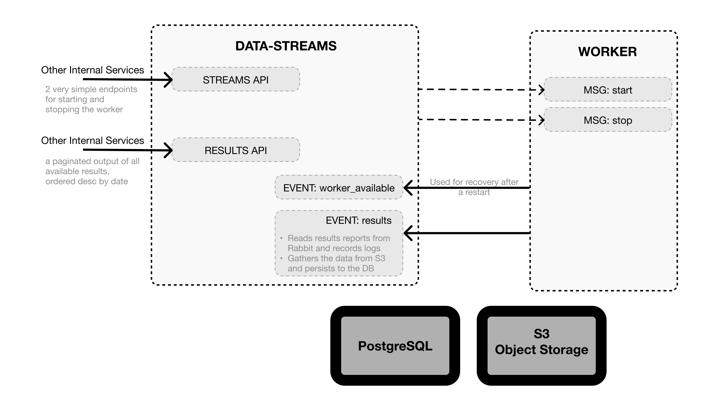

- Start Date: 05.03.2022
- Codename: coding-challenge

> **Comment for the interviewer:**
> I was told that you need to have a clear understanding of my intent. Especially in case I don't get to finish all the features.
> 
> I, on the other hand have no clue about the greater context this solution fits in (surrounding tech, other uses, infrastructure), so I need to analyse the given task in depth and save quite a lot of time by planning ahead.
> 
> Writing a RFC seemed like a good option that covers both needs well. :)

# Summary

A stream-worker pair with an adapter for reading data from IQAir.

- [Summary](#summary)
- [Motivation](#motivation)
- [How to use](#how-to-use)
  - [Development](#development)
  - [Runtime](#runtime)
- [Design and implementation](#design-and-implementation)
  - [Work in Iterations](#work-in-iterations)
  - [Reasoning on Supporting Services:](#reasoning-on-supporting-services)
  - [Transport Protocol](#transport-protocol)
  - [Error Recovery](#error-recovery)
- [Drawbacks](#drawbacks)
  - [Alternatives](#alternatives)
  - [Future prospects](#future-prospects)

# Motivation

One of our customers wants us to help them build a pipeline for [IQAir API](https://www.iqair.com/us/commercial/air-quality-monitors/airvisual-platform/api). They wish us to pull the data regarding a given point into our data-warehouse on a regular basis.

# How to use

## Development
I will set up a `docker-compose` orchestrated project that will spawn the supporting services as well as the two microservices. Below are some common useful commands during development:

```json
// Run the project
./scripts/run-dev.sh
// Shell into the container (or even better, "Attach" via VSCode)
docker exec -ti weld_worker bash

// Run linting, tests, start
yarn lint
yarn test
yarn start
yarn start worker
```

## Runtime

# Design and implementation

The initial task requires us to keep 2 services in a monorepo with use of `@nestjs/microservices`. Here is a general overview, based on those constraints:

- **Data-streams**: 
  - A manager of **worker** processes. 
  - Persists the data in a permanent storage.
  - Offers API endpoints for fetching stored data, starting and stoping worker.
- **Worker**:
  - Able to employ a HTTP adapter to fetch and transform data from external API.
  - External services they may fail, hang or provide corrupt data.
  - Performs data transformations.

## Work in Iterations
I wish to offer a set of progressive goals for the project, starting with **V0** (or the MVP) through adding more robustness in **V1** and offering a peek at what such a service would look like in Weld production [as **V2**](#future-prospects).

For the purposes of the interview, my goal with V0 is to learn TypeScript and NestJS, achieve basic functionality using IQA, NestJS microservices and in-memory storage. The project will contain some rudimentary endpoints and implement both messages and events over TCP as an internal communication protocol.


If all goes well, I wish to continue work on V1 - by implementing some basic robustness into the project. Paginated API, persistent storage, raw datastore, disaster recovery.




[**V2** is there purely as a thought experiment](#future-prospects) and a north star for our technical discussion.

## Reasoning on Supporting Services:
- **PostgreSQL**:
  - Popular database. Open source and battle-tested, with a long and stabile history. 
  - Lightweight. V0/V1 assume that we run a project per customer per integration, this might come in handy.
  - Allows jsonb data storage for our deeply structured data.
  - Very good at concurrent writes.
- **Min.IO**: 
  - An object storage with an S3 compatibile API
  - I'll use it to store the raw responses from other services, as well as intermediate transformed data in a place where other services can asynchronously fetch it later - or re-parse the original data.

## Transport Protocol

NestJS employs communication between microservices in a way that is modeled after the Actor Model. Our use case is fairly simple (`supervisor<->worker`) and we don't expect any complex crosstalk between actors. The built-in transport protocol abstractions give us additional assurance if we need to decouple services in the future. 

**For our purposes, the default TCP transport will be more than enough.** However we have to be mindful that it might be replaced with HTTP+AMQP in the future. So we will pretend that it already uses those when modeling the messages.

We have two separate concerns in the app. The usual `calls` vs `casts` situation:
  - **Messages:**
    - `worker:start`
      - Used to start the fetching process on a schedule.
      - Request is to provide the adapter configuration in following shape:
        ```json
          {
            "adapter": "IQAIR_DAILY",
            "endpoint": "http://api.airvisual.com/v2/nearest_city",
            "secret_key": "mykey",
            "interval": 300000,
            "timeout": 180000,
            "bucket_name": "results"
          }
        ```
      - Response will be idempotent.
      - A config change will take effect only at the end of current interval.
      - Response shape: `{"success": true, "message":"Started fetching from adapter IQAIR_DAILY."}`
    - `worker:stop`
      - Used to clear the worker's interval and config.
      - Response will be idempotent.
      - Response shape: `{"success": true, "message":"Stopped fetching from adapter IQAIR_DAILY."}`
  - **Events:**
    - `data-streams:worker_available`
      - The event signifies that a worker has started and has no job running. Usually as a result of complete failure like a pod restart.
      - Ideally, it would be responded to by sending a start message.
    - `data-streams:results`
      - The body will not contain the full payload. Instead we send only the reference to it.
      - The body will take the following shape:
        ```json
          {
            "adapter": "IQAIR_DAILY",
            "payload": {
              "id": "0c8d4136-8a96-48c4-8e41-52320f8d1194",
              "filename": "results/7a87fe83-f36b-41f4-8cba-7059058db649/0c8d4136-8a96-48c4-8e41-52320f8d1194.json"
            },
            "timestamp": "1646496980"
          }
        ```

## Error Recovery
We describe some common failure scenarios below:
  - `data-streams` crash would not impact the worker. It would keep persisting data to S3. Until we start using Rabbit, the recovery would be manual.
  - `worker` crash is a tricky one. The data would simply stop flowing. Orchestrator would restart the pod, and after booting up, the new pod would ask for a job via `data-streams:worker_available`. Then, it would be the `data-streams` decision if they wish to start it, based on previous input.
  - `worker` stuck in a timeout. For this scenario, the worker might allow the start configuration to describe what the maximum timeout is, after which the worker drops the current workload. This does not stop the worker. The default value will be the same as interval.

# Drawbacks

The absolute main drawback is that this setup assumes that we deploy a single instance of this project, per customer, per integration. The reason for this is two-fold:
  - data-streams is unable to *supervise* workers.
  - the initial task explicitly specifies that workers should run the schedule/interval.

In a similar style, I could imagine that our Solutions Engineers actually want some custom/dynamic transformations to be done on the data. Using RabbitMQ's fanout feature could mitigate this problem.

Being able to definie multiple workers would be key to successful adoption. Unfortunately this raises various supervision and locking concerns. If we knew more about the use case, this would be easier to mitigate. Based on the information I know about Weld, I've left [V2 in the future prospects](#future-prospects) section.

## Alternatives

All alternatives have significant drawbacks in the context of our interview and they all are based around different deployment models.

My first instinct was to build an overcomplicated system of decoupled microservices. We let k8s monitor them, scale up and down, load balance them. The workers themselves would asynchronously pick up messages from the Rabbit queue and publish their workload results. In theory it sounds simple, and that definitely is a popular strategy nowadays. The main benefit of this is that the data-streams replicas (and workers) themselves would be agnostic about which customer uses them, allowing us to scale it to an unreasonable degree.

Apart from being way out of scope of this task, they brought their own problems to the table:
  - **Nobody asked for all that functionality.**
  - Autoscaling (or manual) would be tricky to get right at a Weld-production scale.
  - Potential problem of having too much backlog in RabbitMQ with jobs waiting, and no customer isolation in that scenario.
  - Introducing multiple services, plus a lot of devops overhead.
  - I feel that the scaling problems could in fact be solved the old-school way. By sharding the customers onto separate data-streams instances which spawn an exact number of workers up front.

**Other notable alternatives:**

As part of the above, I've briefly considered that workers could be AWS lambdas. Lower costs plus all of the abovementioned benefits. **However, all of the above drawbacks, plus tough to work with locally, introduces a new tech stack, and finally, vendor-locks us to AWS.**

A common pattern in web development is to use a local database for storing transient jobs. In fact, a couple of years ago I've made such a thing in pure PHP. It did well, performed over 2 million jobs. I can talk at length why that is a bad idea. Today I also learned that it even has an antipattern name - "Database as an IPC".

Cron jobs and a CLI script, as a traditional choice, could also work. **However communication between services would be hard to nail down, we would be unsure about what is running at all times and would have to manually manage crontab.**

As a remote alternative, I just want to point out that this type of project can be written in a OTP language, using just the basic primitives like [supervision tree](https://elixirschool.com/en/lessons/advanced/otp_supervisors), while getting a superior level of resilience and control. I'm not saying that because "[everything looks like a nail](https://www.explainxkcd.com/wiki/index.php/801:_Golden_Hammer)", **I'm aware of the organizational burden a new stack would place on the team** - instead, I'm just trying to raise awareness about other tools/patterns 😉.

... I'm not joking, V2 (below) could be written in Elixir in a week by a junior.

## Future prospects

As written above, I wanted push the idea further. I can easily envision that a service with this functionality already exists in Weld's repertoire. I've made some *¿sane?* assumptions about the customers, product and use cases, and attempted to plan out imaginary work for V2.

V2 would be a production-grade application, with multitenancy, agnostic workers, specialized workers, advanced error recovery, fanout for other internal processors like Athena or data-lakes, raw data storage, ability to version and re-parse data, capacity planning and spike handling, history/compliance log, error reports, over-the-air stream config updates, data-streams sharding.


... Aaand it still can't interrupt a running job, lol.